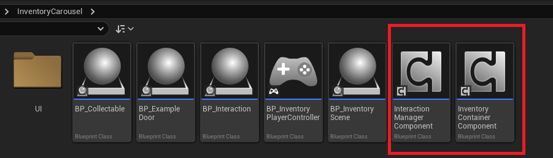

## **Core System Components**

To ensure the full functionality of the plugin, the system relies on two essential components that must be attached to your primary Character or Pawn. The presence of both components is mandatory for the correct functioning of both interaction and inventory management features.

## 1. **Interaction Manager Component**

- Function: Responsible for the centralized management of all in-game interactions.
- Key Responsibilities: Manages the raycasting or collision detection system for interactions, handles player input for interacting with objects, and oversees other important functionalities related to world interaction.

## 2. **Inventory Manager Component**

- Function: Responsible for the complete management of the inventory system.
- Key Responsibilities: Manages the core inventory data structure (adding, removing, moving items), tracks equipped items, and provides the communication interface for the Inventory Carousel itself.

***Essential Requirement***

- Attachment: Both the **Interaction Manager Component** and the **Inventory Manager Component** must be added to the player's main Actor (either a **Character** or **Pawn**) for any plugin functionality to be properly initialized and operate.

## 3. **Component Integration Options**

You have two simple options for integrating the **Interaction Manager Component** and **Inventory Manager Component** into your project:

**Option 1: Using the Provided Example Components**

The most straightforward method is to use the components provided in the example content.

- **Action:** Locate the two component assets (e.g., Blueprints or C++ derived classes) within the plugin's component folder.
- **Benefit:** These examples are intentionally empty, meaning they have no overwritten properties or custom logic added yet. They are ready to be used **directly** by simply adding them to your **Character** or **Pawn.**

**Option 2: Creating New Components**

Alternatively, you can create new custom components based on the base classes provided by the plugin.

- **Action:** Create two new components (e.g., new Blueprints) that inherit from the respective base classes:

    - **InteractionManagerComponent**
    - **InventoryManagerComponent**

- **Benefit:** This approach gives you a clean slate, immediately ready for you to add your **own custom logic and overrides** without touching the example assets.

In both cases, remember that **both** the Interaction Manager Component and the Inventory Manager Component must be attached to your Character or Pawn to function.