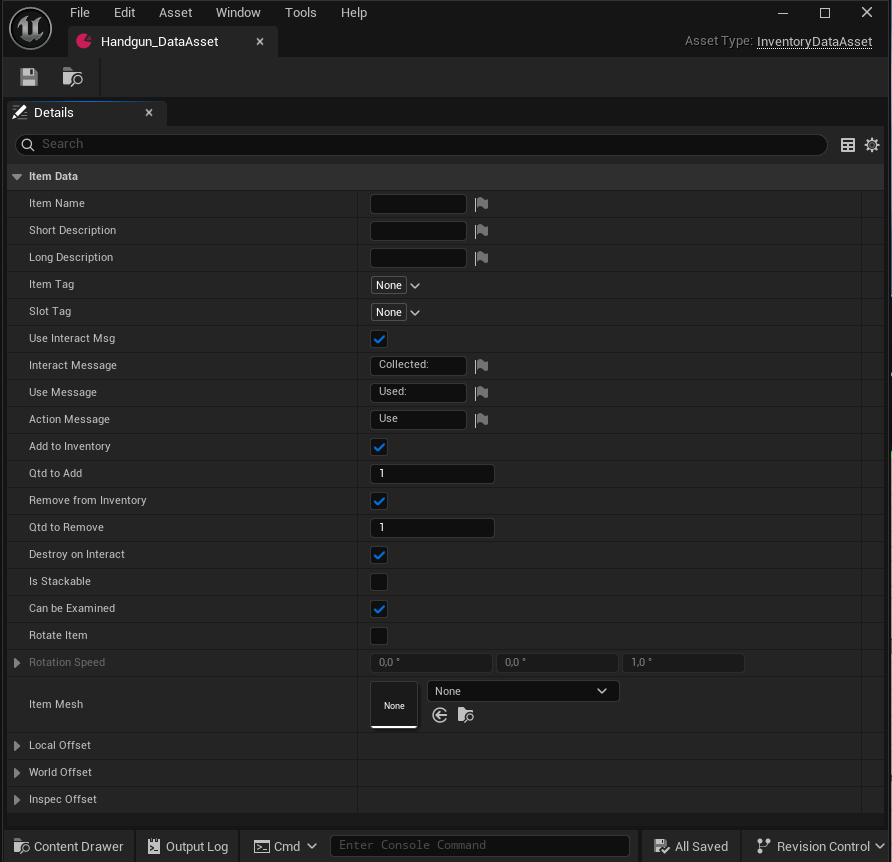

## **Data Assets Configuration**

The plugin utilizes specific **Data Assets** to centralize and manage configuration values for interaction and inventory systems. These assets are crucial for defining default behaviors and linking necessary classes.

## **1. Interaction Data Asset (InteractionDataAsset)**

This Data Asset is **essential** for configuring the core values of the interaction system and specifying the rendering environment.

- **Interaction Configuration Values** - Defines parameters such as interaction distance, delay times, and display text defaults. - Allows designers to tune the feel of interactions globally without modifying code.
- **Scene Class Reference** - **Crucial:** Used to set the Scene Class responsible for rendering the inventory items, typically involving a **Scene Capture Component**. - This link is mandatory for the **Inventory Carousel** to correctly visualize the items.

## **2. Inventory Data Asset (InventoryDataAsset)**

The **Inventory Data Asset** serves as the core structure and blueprint for every single item in your game.

- **Function:** This asset is the nucleus of item definition. For every new item created in the game (e.g., a Pistol, a Health Pack, or a Key), a corresponding, new Inventory Data Asset instance must be created.
- **Structure:** It contains the entire item structure, including properties such as:
    - Display Name and Description
    - Item Model/Mesh Reference
    - Item tag and Name
    - Location, Rotation and Size (Local and World) space

By making each item an instance of the Inventory Data Asset, the system achieves a highly organized and scalable method for managing the entire inventory database.

## **3. Configuring the Interaction Data Asset**

Let's focus on the initial setup required for the core interaction system: creating and naming the **Interaction Data Asset**.

**Step 1: Creating the Asset**

    1. Open the Content Browser.
    2. Right-Click anywhere in an empty area.
    3. Navigate to Miscellaneous.
    4. Select Data Asset.
    5. In the pop-up window, locate and select the Interaction Data Asset class.

**Step 2: Naming the Asset**

Once the asset is created, you must rename it:

- **Rename:** Give the asset a clear, recognizable name, such as **DA_PlayerInteractions** or **DA_Core_InteractionConfig**.

This newly created and named **Interaction Data Asset** will be the central hub for configuring interaction values and linking the necessary rendering classes for your inventory carousel.

The **Interaction Data Asset** is now created and provides a set of sensible default values under the **Interaction Data** category:

The screenshot displays the default settings for the **Interaction Data Asset**. While most properties are indeed self-explanatory—governing parameters like range and detection method—it is important to highlight the key takeaways for the user.

    Detection Mode: Defines the method used to scan for interactable objects (e.g., based on the player's proximity).
    Interaction Distance: The maximum distance (in Unreal units) from which the player can trigger an interaction.
    Detection Frequency: How often (in seconds) the system checks for new interactable objects.
    Show Debug Raycasts: A useful setting for debugging the interaction system in development viewports. Recommended to disable in a shipped game.
    Detection Channel: Specifies the collision channel the system uses to filter and detect interactable objects.

The most critical element in this asset, specific to the carousel plugin, is the **Inventory Scene** property, found at the bottom of the details panel.

- **Default Asset:** By default, this field is populated with a placeholder or an example class, such as ***BP_InventoryScene***, which is included in the plugin's content folder. This example asset contains the necessary **Scene Capture Component** used to render your items for the UI.

- **Customization:** While the default works out of the box, advanced users have the option to **override this value** by creating and selecting a new, custom Scene Capture Blueprint class tailored to their project's visual needs. This process will be detailed in a later section of the documentation.

**Conclusion of Setup**

With the InteractionDataAsset created and its default values reviewed, the core configuration for player interaction is complete. You can now proceed to link this Data Asset to your **Interaction Manager Component** and begin setting up the item-specific **Inventory Data Assets**.

## **4. Configuring the Inventory Data Asset**

**Step 1: Creating the Asset**

    1. Open the Content Browser.
    2. Right-Click anywhere in an empty area.
    3. Navigate to Miscellaneous.
    4. Select Data Asset.
    5. In the pop-up window, locate and select the Inventory Data Asset class.

**Step 2: Naming the Asset**

Once the asset is created, you must rename it:

- **Rename:** Give the asset a clear, recognizable name, such as **DA_Flashlight** or **Flashlight_DataAsset**.

**Inventory Data Asset Configuration**

The Inventory Data Asset serves as the core item blueprint for your game. As shown in the screenshot, most properties under Item Data are straightforward and relate to standard item management (e.g., names, messages, stack settings).

This section will detail the essential configuration fields and provide a focused explanation of the crucial Offset properties, which control the item's visual presentation across different scenarios.

**Core Item Properties**

These properties define the basic identity and functionality of the item:

- **Item Name / Short / Long Description:** Display names and text used in the UI and documentation. - Supports localization through the engine's text system.
- **Item Tag / Slot Tag:** Unique identifiers used for programmatic lookups and specifying which carousel Slot this item belongs to. - Ensures the item appears in the correct section of the inventory carousel.
- **Action Messages:** - Customizable text used for UI prompts (e.g., Collect Message, Use Message). - Define the user experience when interacting with or using the item.
- **Qtd to Add / Remove:** - Defines the default quantity added or removed from the inventory upon interaction or use. - Essential for managing stackable items.
- **Is Stackable / Can be Examined:** - Boolean flags controlling fundamental item behavior. - Can be Examined enables the dedicated inspection view, which uses the Inspec Offset property.
- **Rotation Speed:** - Defines the pitch, yaw, and roll rotation rate of the item when the Rotate Item flag is active. - Often used for aesthetic flourish in the inventory view.
- **Item Mesh:** - The static or skeletal mesh asset that represents this item in the game world and the inventory view. - This asset is required for the system to render the item.

**Understanding Item Offsets (Transforms)**

The Offset properties are crucial because they dictate the item's visual Transform (Position, Rotation, and Scale) in three different contexts. They all use the same structure to adjust the Item Mesh.

- **Local Offset:** Inventory/Carousel View - Represents the Transform of the item as it is being rendered by the Scene Capture component for the inventory UI. Use this to position the item correctly inside the carousel viewer.
- **World Offset:** Collectable/Pickup View - Represents the Transform of the item in the game world when it is placed as a collectable (pickup). Use this to adjust the appearance, rotation, and scale of the item in the 3D environment.
- **Inspec Offset:** Inspection/Examination View - Represents the Transform of the item when the player initiates the detailed examination screen. Use this to set the optimal viewing position, rotation, and scale for player inspection.

After configuring your individual **Inventory Data Assets** (the "nucleus" of each item), the next step is to catalog these items and introduce them to the carousel system. This crucial indexing is managed through a **Data Table**.