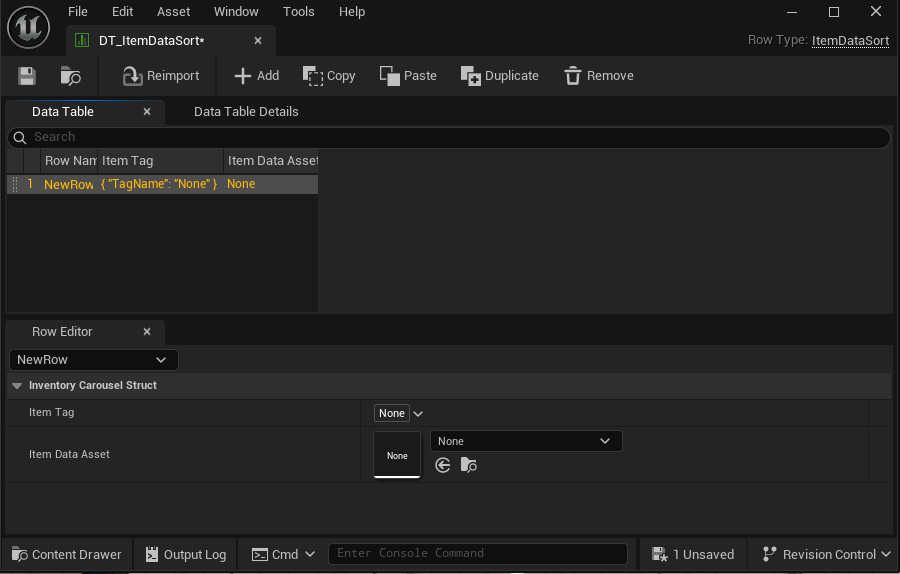
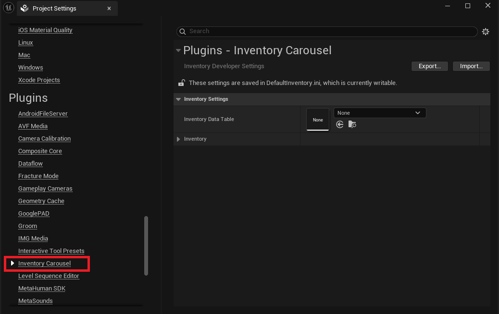

## **Integrating the Master Inventory Data Table**

After creating your individual item Data Assets, the final step is to configure the core plugin settings to recognize your item catalog. This involves setting up the **Data Table** and linking it in the **Project Settings**.

**Step 1: Creating the Inventory Data Table**

This table acts as the registry that links all your item Data Assets using a dedicated Struct.

1. **Creation:** In your Content Browser, **Right-Click** and select **Miscellaneous** -> **Data Table**.
2. **Select Row Type:** In the prompt, locate and select the required row structure: ***ItemDataSort***
3. **Rename:** Rename the new asset clearly (e.g., ***DT_MasterInventoryList*** or ***DT_ItemDataSort***).

**Step 2: Populating the Data Table**

Once created, open the Data Table to catalog your items

- **Row Name:** This is optional
- **Item Tag:** The unique Tag ID of the item. - Used for easy programmatic filtering and lookups within the inventory system.
- **Item Data Asset:** **Crucial Link:** The direct object reference to the specific **Inventory Data Asset** you created for this item (e.g., the Handgun_DataAsset).

**Step 3: Setting the Master Data Table in Plugin Settings**

The final step is to tell the **Inventory Carousel** plugin which table to use for item management

1. **Open Project Settings:** Navigate to **Edit** -> **Project Settings**.
2. **Locate Plugin Settings:** Scroll down the left sidebar and select **Plugins** -> **Inventory Carousel**.
3. **Assign Data Table:** Under the Inventory **Settings** section, locate the **Inventory Data Table** field.
4. **Set Value:** Assign the **Data Table** you just created (***DT_ItemDataSort*** or equivalent) to this field.

This successfully registers your entire item catalog with the plugin, enabling the **Inventory Manager Component** to access all item data required for the carousel to function.