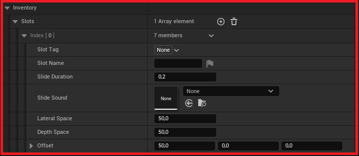

## 1. **Open the project settings and go to "Plugins/Inventory Carousel"**

## 2. **Settings**

- Expand "Inventory"

Add the required Slots for your project and configure each parameter according to your desired inventory layout

This section details the members of the Slots array, which represent the individual configuration settings for each item or position within the inventory carousel.

- Slot Tag - A unique tag identifier used to programmatically reference the specific slot within the carousel system. Default value is None.
- Slot Name - The display or descriptive name for the slot, primarily used for visual reference in the development interface.
- Slide Duration - The time, in seconds, the carousel takes to complete the transition from one item to the next. A value of 0.2 indicates a fast transition.
- The audio resource (Sound Asset) that will be played when the carousel initiates the transition (slide) to this specific slot. Default value is None.
- Defines the lateral distance (X or Y axis, depending on the carousel's orientation) between the central (active) item and the adjacent items (neighboring items).
- Defines the depth distance between the central (active) item and the adjacent items (neighboring slots). This creates the depth perspective in the carousel.
- Defines the positional displacement (translation) of the central (active) item relative to the Scene Capture Component (the camera that renders the carousel for the UI).

## 3. **Practical Examples of Slot Usage:**

The slots are intended to categorize the user's inventory. Examples of categories that can be assigned to different slots include:

- Notes & Documents: (e.g., lower Slide Duration for a snappy flip, and a smaller Lateral Space to keep documents close).
- Medical Items (Consumables): (e.g., standard Slide Duration with a distinct Slide Sound to differentiate them from gear).
- Equipment & Weapons: (e.g., higher Lateral Space and Depth Space values to give larger models sufficient breathing room, often coupled with a significant Offset for better visibility).
- Keys & Key Items: (e.g., using a unique Slot Tag to allow developers to quickly query the system for essential quest items).

By leveraging the parameters like Slide Duration, Lateral Space, Depth Space, and Offset for each slot, developers can create a dynamic and visually engaging inventory experience that reflects the nature of the items being displayed.

## 4. **Accessing Plugin Content and Examples**

For optimal use and complete understanding of the plugin's features and examples, you must locate the plugin's content folder within the engine's structure.

***Locating the Content***

To ensure the example content and assets are visible in your Content Browser:

1. **Enable View Options:** In the lower right corner of the Content Browser window, ensure the following viewing options are activated:

- **Show Engine Content**
- **Show Plugin Content**

2. **Navigate to the Plugin Directory:** Once enabled, you will be able to find the relevant content by navigating through the following path:

***Engine/Plugins/InventoryCarousel/Content***

This directory contains essential example assets and demonstration blueprints that can serve as a reference for integration into your project.